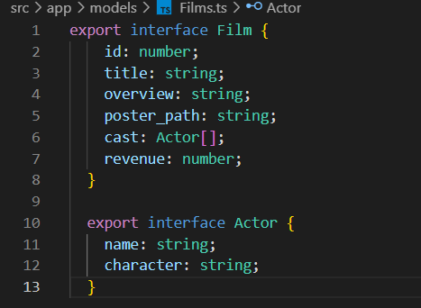

= Projet Movie
:author: Caffiaux Elian et Rodrigues Loïc
:docdate: 2023-04-15
:description: Projet Movie
:toc: left
:toclevels: 5

== Présentation
 Création d'une application Web Angular sur des films. L'objectif est de permettre aux utilisateurs de rechercher des films, d'afficher les détails des films, de voir les films populaires et de rechercher des films par mot-clé. L'application utilise l'API de The Movie Database (TMDb) pour récupérer les données des films.

== Fonctionnalités
Ce projet propose une application qui permet à l'utilisateur de commander des boxes de sushis et de les transmettre à la production (cuisine). Les fonctionnalités implémentées sont les suivantes :

- Une page qui affiche les Films popualires du moment.
- Pour chaque film, un bouton permet d'accéder aux détails des films.
- Sur la page de détails, un bouton permet d'ajouter un film dans votre liste des favoris.
- Accès à vos films favoris.

== Utilisation

====
La page "Home" présente une explication du site ainsi que les films a venir.

====

====
La page "liste" présente la liste des films popualires disponibles sur l'api. Si vous souhaitez en savoir plus sur un film en particulier, il suffit de cliquer sur le bouton "Détails" correspondant.

====

====
La page "Détails" affiche les informations détaillées du film que vous avez sélectionnée. Vous pouvez également ajouter cette box à votre panier en cliquant sur le bouton "Ajouter aux favoris".

====

====
La page "Favoris" affichera la liste des films que vous avez sélectionnées.  

====

== Codes
=== Home

=== Film

=== Détails

=== favoris
image:images/favorisht.png[]

=== Service film

=== Service details

=== Service favoris

=== Filmts

=== Environnement API

== Diagramme
=== Diagramme d'utilisation

=== Diagramme des tiers

== Structure JSON
[source,json]
====
[source,json]
----
{
  "films": [
    {
      "id": 1,
      "title": "Film 1",
      "overview": "Résumé du film 1",
      "release_date": "2022-01-01",
      "poster_path": "/chemin/vers/image1.jpg",
      "backdrop_path": "/chemin/vers/image1_backdrop.jpg",
      "vote_average": 7.5,
      "genres": [
        {
          "id": 28,
          "name": "Action"
        },
        {
          "id": 12,
          "name": "Aventure"
        }
      ]
    },
    {
      "id": 2,
      "title": "Film 2",
      "overview": "Résumé du film 2",
      "release_date": "2022-02-01",
      "poster_path": "/chemin/vers/image2.jpg",
      "backdrop_path": "/chemin/vers/image2_backdrop.jpg",
      "vote_average": 8.0,
      "genres": [
        {
          "id": 18,
          "name": "Drame"
        },
        {
          "id": 53,
          "name": "Thriller"
        }
      ]
    },
    ...
  ],
  "favoris": [
    {
      "id": 1,
      "title": "Film 1",
      "overview": "Résumé du film 1",
      "release_date": "2022-01-01",
      "poster_path": "/chemin/vers/image1.jpg",
      "backdrop_path": "/chemin/vers/image1_backdrop.jpg",
      "vote_average": 7.5,
      "genres": [
        {
          "id": 28,
          "name": "Action"
        },
        {
          "id": 12,
          "name": "Aventure"
        }
      ]
    },
    ...
  ]
}
----
====

== Cybersécurité
Voici une liste des scénarios de sécurité redoutés pour mon projet de site de vente de sushi :

Protection contre les attaques par déni de service (DoS) : Des mesures de protection doivent être mises en place pour prévenir les attaques DoS, qui peuvent entraîner une surcharge du serveur et rendre le site indisponible.

Sécurité des API : Les API utilisées par le site doivent être sécurisées pour empêcher les accès non autorisés et les attaques par injection de code malveillant.

Audit de sécurité régulier : Le site doit faire l'objet d'un audit régulier pour identifier les failles de sécurité potentielles et y remédier avant qu'elles ne soient exploitées par des attaquants.

Formation et sensibilisation à la sécurité : Les utilisateurs et les développeurs du site doivent être formés et sensibilisés aux bonnes pratiques de sécurité pour réduire les risques d'attaques et de violations de sécurité.

== Technologies utilisées
Angular 13,
TypeScript,
HTML/CSS,
Bootstrap,
RxJS.

== Contributeurs
CAFFIAUX Elian et RODRIGUES Loïc